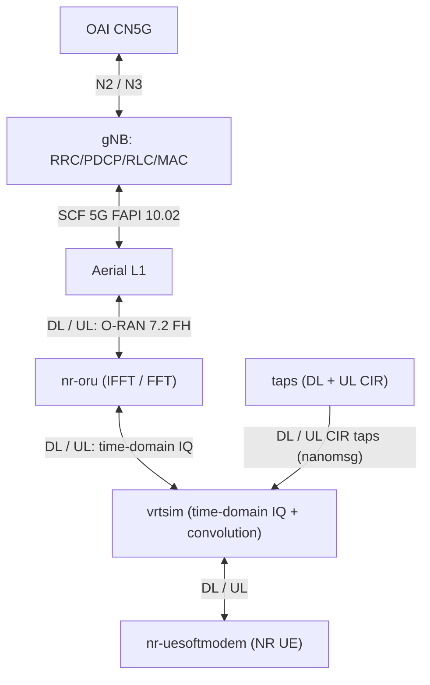

# GH200 / ASET: O-RU + gNB + NR UE

Run O-RU, gNB (FHI 7.2), and NR UE (vrtsim) on one GH200 host, with OAI CN5G for registration.

## Architecture



The diagram shows the Aerial deployment. In the OAI-only deployment, `gnb-fhi72`
contains both L2 and the built-in OAI L1, so the FAPI/nvIPC boundary and
`nv-cubb` container are absent.

### L2 and the FAPI 10.02 interface

With `docker-compose.aerial.yml`, `gnb-aerial` is the OAI VNF containing the
gNB upper layers and L2 (RLC, MAC, and scheduler), while `nv-cubb` supplies the
NVIDIA Aerial cuPHY L1. The L2/L1 boundary uses the Small Cell Forum 5G FAPI
baseline **SCF 222.10.02**:

- P5 messages configure, start, and stop the PHY.
- P7 slot and data messages carry scheduling requests from L2 to L1 and PHY
  indications from L1 to L2.
- FAPI is transported through nvIPC shared memory, not over the placeholder
  loopback addresses and ports in the gNB `MACRLCs` configuration.
- Compose makes `gnb-aerial` join the `nv-cubb` IPC namespace with
  `ipc: container:nv-cubb`. Aerial loads
  `conf/l2_adapter_config_P5G_GH.yaml`, whose `msg_type` is `scf_5g_fapi`.

See [`../../Aerial_FAPI_Split_Tutorial.md`](../../Aerial_FAPI_Split_Tutorial.md)
and [`../../nfapi.md`](../../nfapi.md) for the FAPI message flow and OAI split
details.

## Layout

| Path | Role |
|------|------|
| `setup_ru_ifs-gh200.sh` | 5 SR-IOV VFs on `aerial00` (OAI DU + O-RU + Aerial DU) |
| `docker-compose.yml` | OAI RAN stack: O-RU + gNB + UE + remote CIR taps (+ build stages) |
| `docker-compose.aerial.yml` | Aerial cuPHY L1 overlay (`include:` base) |
| `conf/` | gNB / O-RU / UE / Aerial L1 configs. gNB cell block is shared in `gnb.sa.band77.gh200.common.conf`; L1 wrappers `@include` it. Compose binds the wrapper to `/opt/oai-gnb/etc/gnb.conf` and the common file beside it (stock entrypoint path). |
| `taps/static/` | Static taps image (`publish_taps.py --source static`) |
| `taps/common/` | Shared `publish_taps.py`, FlatBuffers schema, `set-gain` |
| [`../oai-cn5g/`](../oai-cn5g/) | 5GC (AMF at `192.168.70.132`) |

gNB `amf_ip_address` / N2–N3 addresses expect the CN5G docker network (`192.168.70.128/26`). Bring CN5G up **before** the RAN stack or the UE will not finish registration.

## 1. Build RAN images (once / after code changes)

From `doc/tutorial_resources/aset` (Compose builds the shared `ran-base` / `ran-build`
stages and all runtime images in one graph):

```bash
pushd doc/tutorial_resources/aset
docker compose build
popd
```

The Aerial compose files require Docker Compose v2.20 or newer (`include:`) and
BuildKit (`additional_contexts`). Runtime Dockerfiles `FROM aset-ran-build` (a
bake alias), not `ran-build-fhi72-aset:latest`, so a single `compose build`
packages the new binaries instead of racing the previous tagged build image.
Keep host-specific values in an untracked `.env` or export them in the shell:

```bash
export COMPOSE_BAKE=true
export DISPLAY=:1
export CUBB_SDK=/path/to/aerial-cuda-accelerated-ran
```

Images: `ran-base-aset`, `ran-build-fhi72-aset`, `oai-nr-oru-aset`, `oai-gnb-fhi72-aset`, `oai-nr-ue-aset` (+ `oai-gnb-aerial-aset` for the Aerial overlay).

`ran-base-aset` is `Dockerfile.base.ubuntu` retagged. The FHI 7.2 *build* is a separate recipe (`Dockerfile.build.fhi72.aset.ubuntu`) — not layered on upstream `Dockerfile.build.fhi72.ubuntu` — because ASET needs DPDK 22.11, aarch64/xRAN+Arm RAL, mlx5, and `OAI_VRTSIM_TAPS_CLIENT`. Runtime Dockerfiles are named `*.aset.ubuntu` and tag images `*-aset`.

Build enables `OAI_VRTSIM_TAPS_CLIENT` (needed for `--vrtsim.taps-socket`). Images use `ubuntu:noble`.

**Aerial gNB (`oai-gnb-aerial-aset`)** packs nvIPC from your cuBB SDK checkout during the
Docker build (`docker/Dockerfile.gNB.aerial.aset.ubuntu` runs `pack_nvipc.sh` in an
`nvipc-src` stage). Set `CUBB_SDK` to the same tree mounted into `nv-cubb` (default in
`docker-compose.aerial.yml`):

```bash
pushd doc/tutorial_resources/aset
docker compose -f docker-compose.aerial.yml build gnb
popd
```

## 2. Start 5GC

From the OAI repository root:

```bash
pushd doc/tutorial_resources/oai-cn5g
docker compose -f docker-compose.yaml up -d
popd
```

AMF should be reachable at `192.168.70.132` (see that compose file). Keep this running while you use the RAN stack.

All CN5G containers attach to the Docker bridge `oai-cn5g-public-net`
(`192.168.70.128/26`, host bridge name `oai-cn5g`). Each container has one
Linux network interface, `eth0`; the named 5G interfaces below are logical
interfaces carried over it.

| Container | IPv4 (`eth0`) | Role and named interfaces |
|-----------|---------------|---------------------------|
| `oai-nrf` | `192.168.70.130` | NF registry and discovery: `Nnrf` SBI |
| `mysql` | `192.168.70.131` | Subscriber/configuration database; internal SQL, not a 5G reference interface |
| `oai-amf` | `192.168.70.132` | Access and mobility: `N1` NAS, `N2` NGAP/SCTP (`38412`), and `Namf` SBI |
| `oai-smf` | `192.168.70.133` | Session control: `Nsmf`/`N11` SBI and `N4` PFCP (`8805/udp`) |
| `oai-upf` | `192.168.70.134` | User plane: `N3` GTP-U (`2152/udp`), `N4` PFCP, `N6`, and configured `N9` |
| `oai-ext-dn` | `192.168.70.135` | External data network, the peer side of `N6` |
| `oai-udr` | `192.168.70.136` | Unified data repository: `Nudr` SBI |
| `oai-udm` | `192.168.70.137` | Unified data management: `Nudm` SBI |
| `oai-ausf` | `192.168.70.138` | Authentication server: `Nausf` SBI |
| `ims` | `192.168.70.139` | IMS/SIP application endpoint for the `ims` DNN |

The gNB uses `192.168.70.129` on the same bridge: `N2` terminates at
`oai-amf`, and `N3` terminates at `oai-upf`. SBI services use HTTP/2 on port
`8080`.

## 3. Host NICs (GH200)

All fronthaul VFs live on **one PF** (`aerial00` / `0000:01:00.0`) so the eSwitch can forward DU↔RU by dest MAC (legacy VEB loops VF↔VF internally, no external switch).

| Role | Where | Typical BDF (confirm after setup) |
|------|--------|-----------------------------------|
| OAI gNB (DU) | VST VFs on `aerial00` | `0000:01:00.3` U, `0000:01:00.4` C |
| O-RU | VST VFs on `aerial00` | `0000:01:00.5` U, `0000:01:00.6` C |
| Aerial cuBB (DU) | trunk VF on `aerial00` | `0000:01:00.7` (vlan 3, pcp 0) |
| UE | vrtsim behind O-RU | — |

The setup script assigns distinct locally-administered MACs for all three roles (host-independent). The OAI DU sends **untagged** eCPRI and relies on VF hardware port-VLANs (VST). **Aerial cuBB software-tags VLAN 3** (the tag is built in the fh driver, `aerial-fh-driver/lib/flow.cpp`) and its RX steering matches the **full 802.1Q TCI, including the PCP bits** (`peer.cpp`). So cuBB binds a **trunk** VF (no VST, so its self-tag isn't doubled) and must use **`pcp: 0`** — the O-RU VF's VST inserts the UL tag with PCP 0 by default, so `pcp: 0` (tci `0x0003`) is what makes cuBB's RX flow match; `pcp: 7` (tci `0xE003`) would not match and UL would leak to the kernel netdev (`uplane_rx` stays 0). cuBB can't use the PF: legacy VEB doesn't loop VF→PF-MAC traffic, so the O-RU's UL never reaches a PF-bound cuBB. MST: `/dev/mst/mt41692_pciconf0`.

```bash
pushd doc/tutorial_resources/aset
sudo ./setup_ru_ifs-gh200.sh
# paste printed dpdk_devices and ru_addr/du_addr into conf/*.gh200.conf if BDFs/MACs differ
/usr/local/bin/dpdk-devbind.py --status   # VFs must be mlx5_core, not vfio-pci
popd
```

Same-PF VF↔VF forwarding by peer MAC; U/C split by VLAN 3/4. Hugepages: compose mounts host `/dev/hugepages` into O-RU/gNB.

## 4. Start RAN

```bash
pushd doc/tutorial_resources/aset

# O-RU + gNB + UE + remote CIR taps (needs images from step 1 with TAPS_CLIENT)
docker compose up --build

# Aerial L1 alternative: gNB L2 -- FAPI 10.02/nvIPC -- nv-cubb L1
docker compose -f docker-compose.aerial.yml up --build

popd
```

`docker-compose.yml` includes the `taps` service (`publish_taps.py --dual --source static`); `nr-oru`/`nr-ue` read its CIRs via `--vrtsim.taps-socket`. The XForms soft-scope (`-d`) on all three units is gated on `DISPLAY` (`${DISPLAY:+-d}`); set `DISPLAY=:1` to enable it or run with `DISPLAY=` to disable it.

For the Aerial stack, startup ordering is important: start the CIR publisher
(`taps`), then `nr-oru`, `nv-cubb`, the gNB, and finally `nr-ue`.
Do not gate `nr-oru` on `nv-cubb` health; Aerial L1 starts after the O-RU.

Live gain when taps are up (dB by default; `--linear` for amplitude):

```bash
docker exec taps set-gain --dl -20
docker exec taps set-gain --ul -6
docker exec taps set-gain --dl status
```

See [`taps/static/README.md`](taps/static/README.md).

## 5. Run traffic

After the UE registers and establishes its PDU session, start an `iperf3` server
inside the UE container:

```bash
docker exec -it nr-ue iperf3 -sB 10.0.0.2
```

In another terminal, run bidirectional UDP traffic from the external data
network for eight hours at 50 Mbit/s, reporting every 30 seconds:

```bash
docker exec -it oai-ext-dn iperf3 -uc 10.0.0.2 --repeating-payload --bidir -t 28800 -b 50m -i 30
```

## 6. Quick checks

```bash
docker logs nr-oru 2>&1 | grep -E 'starting vrtsim|packets received|Noise power'
docker logs gnb-fhi72 2>&1 | grep -E 'o-du|NGAP|AMF'
docker logs nr-ue 2>&1 | tail -50
```

| Symptom | Likely cause |
|---------|----------------|
| UE no registration | CN5G not up / AMF `192.168.70.132` unreachable |
| `Build with OAI_VRTSIM_TAPS_CLIENT` | Using taps compose without rebuilt images → use base `docker compose up` or rebuild |
| RU `packets received 0` | FH VFs / peer MACs / same-PF path — re-run setup and check conf `dpdk_devices` |
| UE shm assert | O-RU died before writing `/run/vrtsim/vrtsim_connection` |

## Future work

- Benchmark the OAI-only solution (bandwidth, antenna ports, throughput) against the Aerial L1 stack.
- Expand support to 100 MHz bandwidth with 4 antenna ports.
