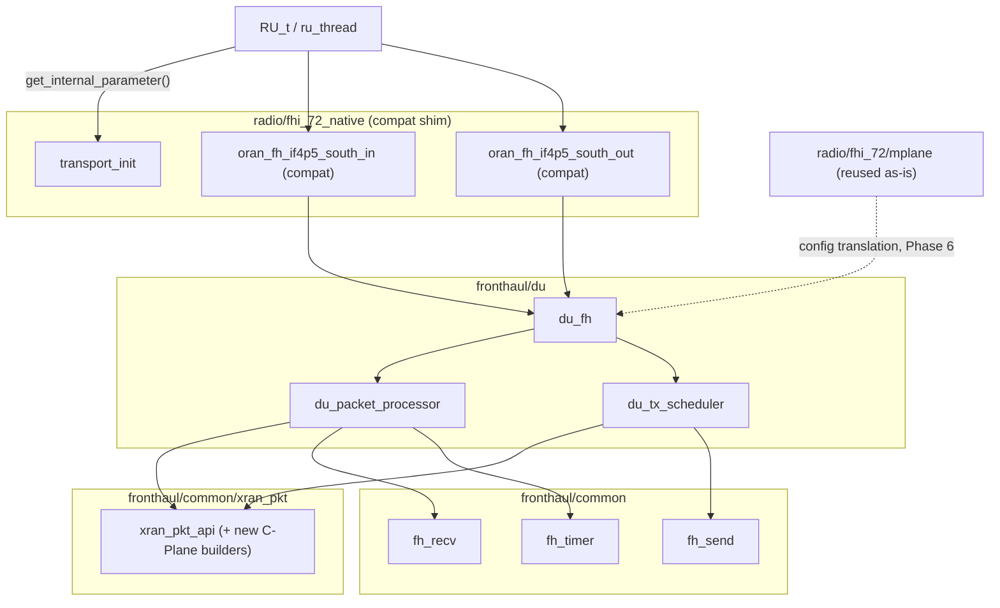
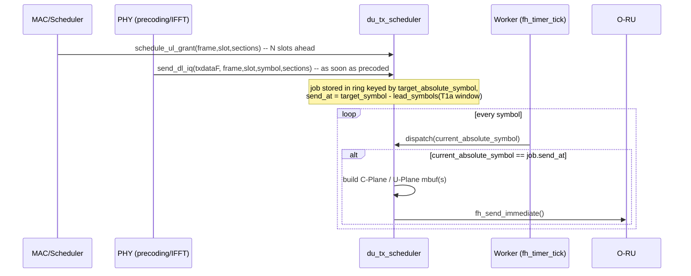

<!-- SPDX-License-Identifier: CC-BY-4.0 -->

# O-DU Fronthaul — Implementation Plan

Native 7.2x split O-DU fronthaul, complementing `fronthaul/oru/`. Target: a drop-in
replacement for the current `radio/fhi_72/` + vendor libxran wrapper, both functionally
and at the ABI the rest of OAI calls into, so `RU_t`/`ru_thread` need no changes.

## Goals

- Native C/U-Plane TX (DL) and RX (UL/PRACH) for the O-DU side of a 7.2x split, built on
  the same `fronthaul/common/` (`fh_recv`/`fh_send`/`fh_timer`) and `fronthaul/common/xran_pkt/`
  primitives already used by `fronthaul/oru/`.
- Feature- and ABI-match the current `radio/fhi_72/` (libxran) wrapper closely enough
  that it's selectable as an alternative transport plugin with no changes to
  `RU_t`/`ru_thread` call sites.
- TDD **and** FDD.
- Reuse the existing M-Plane stack (`radio/fhi_72/mplane/`) unchanged — only translate
  its output into our own config struct.

## Non-goals (for this effort)

- Mixed/multi-numerology per instance (vendor xran's `perMu[]`). Single numerology per
  instance, matching `fronthaul/oru/`.
- Multi-CC/multi-sector. Not exercised by OAI today (`oaioran.c` hardcodes single CC),
  so not a real feature gap.
- Reimplementing M-Plane/YANG/NETCONF. Reused as-is (see below).

## Why this is harder than mirroring `oru/`

The O-RU only has one delay-sensitive direction (DL C/U-Plane arriving from the DU);
its UL send is immediate, no scheduling required (`fh_send_immediate` sends the moment
the app calls it). The O-DU has the opposite problem on **both** directions:

- **DL (TX):** C-Plane scheduling commands and U-Plane IQ must each arrive at the RU
  inside a window *ahead of* the OTA symbol (`T1a_min/max_cp_dl`, `T1a_min/max_up`) —
  the DU-side counterpart of the `T2a_cp/up_min/max_uS` already in `oru_fh_config_t`,
  same wire constraint, opposite endpoint. This needs a genuine software scheduler:
  enqueue now, transmit later, driven off the same per-symbol `fh_timer_tick` the RU
  already uses for window eviction.
- **UL (RX):** PUSCH/PRACH arrives *after* OTA symbol time within `Ta3_min/max`. This
  mirrors the RX reassembly/eviction window already implemented for DL in
  `oru_packet_processor.c` (`dl_symbol_rx_window` + `push_symbol_job`), just direction-flipped.

## The real integration seam

Investigation of `radio/fhi_72/` showed the actual replaceable boundary is **not**
`common_lib.h`'s generic `trx_read/write_func2` — it's a narrower plugin ABI:

- `transport_init(openair0_device_t*, openair0_config_t*)` — `dlopen`'d by
  `openair0_transport_load` (see `common_lib.c`), wires up `trx_start/stop/end_func`,
  `trx_get_stats_func`, and one unusual hook: `get_internal_parameter`, a string-keyed
  function lookup.
- `ru_thread` fetches `"fh_if4p5_south_in"` / `"fh_if4p5_south_out"` through that lookup
  and calls them once per slot:
  - `oran_fh_if4p5_south_in(RU_t *ru, int *frame, int *slot)` — blocks until the slot's
    UL/PRACH data is ready (drains-and-catches-up under load, `MAX_QUEUE_LENGTH_NO_JUMP`).
  - `oran_fh_if4p5_south_out(RU_t *ru, int frame, int slot, uint64_t timestamp)` — writes
    DL IQ + beam ids for the slot.
- All actual C/U-Plane timing happens inside libxran's own worker threads
  (`xran_start_worker_threads`, `xran_timingsource_start`). OAI's RU thread never
  touches fronthaul timing directly — that's exactly the job `du_tx_scheduler` below
  takes over, just in our own code instead of a closed-source library.

Hitting this same seam (not just building equivalent capability under a new API) means
`RU_t`/`ru_thread.c` don't change — only the config selecting which `.so` loads does.

## Directory layout

```
fronthaul/
  common/                      (unchanged — already direction-agnostic)
    fh_compression.[ch]
    xran_pkt/                  (extend: add C-Plane builders, see Phase 1)
  oru/                         (unchanged, except the hoist in Phase 1)
  du/
    du_fh.[ch]                 -- mirrors oru_fh.[ch]: init/start/stop/config, DPDK bootstrap
    du_packet_processor.[ch]   -- mirrors oru_packet_processor.[ch]
    du_tx_scheduler.[ch]       -- NEW: delayed-send engine for DL C/U-Plane
    tests/                     -- mirrors fronthaul/oru/tests/ structure

radio/
  fhi_72/                      (unchanged — vendor xran wrapper stays available)
  fhi_72_native/               -- NEW: compat shim exposing the same transport_init /
                                   get_internal_parameter ABI, backed by fronthaul/du/
```

## Architecture



### DL TX scheduling (new)



## Module design

### `du_packet_processor` — UL/PRACH RX reassembly

Direct port of `dl_symbol_rx_window` / `push_symbol_job` / `handle_absolute_symbol_tick`
from `oru_packet_processor.c`, direction-flipped: DU has no C-Plane to parse on this leg
(it already knows what it scheduled), so the window just accumulates U-Plane fragments
per absolute symbol and evicts on `Ta3_max` expiry, exactly like the RU's DL window
evicts on `T2a_min_up`.

### `du_tx_scheduler` — DL C/U-Plane delayed send (the new piece)

- One ring for DL U-Plane jobs, one for UL-grant/PRACH C-Plane-only jobs (no IQ payload),
  indexed by `target_absolute_symbol % WINDOW_DEPTH`, same trick as `dl_symbol_rx_window`.
- `send_at_symbol = ota_symbol - T1a_max_sym_diff + 1` (as late as the window allows,
  minus one tick of slack — dispatch only runs once per symbol, so at least one full
  symbol of margin is needed off both edges).
- Two independent deadlines per DL allocation: C-Plane (per slot/allocation) must be
  sent before the earliest U-Plane symbol of that slot; each has its own config window
  and its own `send_at_symbol`.
- UL/PRACH scheduling commands are C-Plane-only jobs on the same scheduler, own advance
  window (`T1a_min/max_cp_ul`, distinct from the DL C-Plane window).
- Late-enqueue detection: if the app enqueues after `send_at_symbol` has already passed,
  drop with a counter (`app_too_late_tx`, mirrors `application_too_slow` on the RU side)
  rather than send stale.
- Job descriptor carries a **list of sections per symbol** (PRB range + beam id each),
  not a single PRB range — required to match the current wrapper's per-`xran_prb_elm`
  beam-index granularity (multiple non-contiguous PRB groups per symbol, each with its
  own beam).

### C-Plane packet builders (new, in `xran_pkt_api.c`)

Nothing in `fronthaul/common/xran_pkt/` currently *builds* C-Plane messages — only *parses*
them (`handle_dl_cplane_packet`, `handle_ul_cplane_packet`, `handle_prach_cplane_packet`
in `oru_packet_processor.c`). Add the inverse: section-type-1 (DL/UL sched) and
section-type-3 (PRACH) builders, same field layout, byte order reversed.

Also hoist `fill_ecpri_header` / `fill_radio_app_header` / `fill_data_section_header`
out of `oru_packet_processor.c` (currently private there) into `xran_pkt_api.c` as
shared builders — DU's DL U-Plane path needs the exact same three calls
(`XRAN_DIR_DL` instead of `XRAN_DIR_UL`), so RU and DU share one packet-construction
library instead of duplicating it.

### Duplex mode (TDD/FDD)

`oaioran.c`'s `is_tdd_*` helpers all early-exit when `frame_conf->nFrameDuplexType ==
XRAN_FDD` — in FDD every symbol carries both directions simultaneously (separate
frequency bands, not time division), so there's no guard-slot skip logic at all.

Add a duplex-mode field to config. Bitmask generation in `init_packet_processor`-
equivalent becomes duplex-aware:
- TDD: `dl_symbol_bitmask`/`ul_symbol_bitmask` built from the TDD pattern, as today in
  `oru/`.
- FDD: both bitmasks are all-1s (every symbol is simultaneously a DL-schedulable and
  UL-schedulable symbol) — RX reassembly and TX scheduler run concurrently on every
  symbol rather than being time-multiplexed. Both subsystems are already independent
  rings, so this needs no structural change beyond bitmask setup — confirm no other
  code path assumes TDD mutual exclusion before shipping this.

### `radio/fhi_72_native` compat shim

- `transport_init` / `get_internal_parameter` with the same exported symbol names as
  `radio/fhi_72/oran-init.c`, so it's swapped in purely via config (which `.so` gets
  loaded), same as choosing between other transports today.
- Owns the blocking-FIFO-with-catch-up semantics (`MAX_QUEUE_LENGTH_NO_JUMP`, jump
  logging) on top of `du_fh`'s poll-based API — this logic belongs in the shim, not in
  `fronthaul/du/`, which stays poll-based like `oru_fh` for consistency with the rest of
  the native library.
- PRACH format/`kbar` handling is already OAI-side (`nr_prach_info_t`, `get_prach_info()`)
  and transport-agnostic — reused unchanged.
- Stats: extend `du_packet_processor_stats_t` to cover the same counters
  `print_fhi_counters` logs today (rx/tx pps/kbps, on-time/early/late/corrupt/dup,
  per-antenna pusch/prach counts) — CI/ops tooling likely keys off these log lines.

### M-Plane reuse

`radio/fhi_72/mplane/` (YANG/NETCONF, RU session management) stays completely
untouched. Its output today is a vendor-shaped `struct xran_fh_init` / `struct
xran_fh_config` (built by `get_xran_config()` in `oran-config.c`). Add one small
translation function — `oran_config_to_du_fh_config()` — that maps that same
mplane-derived config into `du_fh_config_t`, mirroring what `get_xran_config()` already
does for libxran. This is a translation shim only; no NETCONF/YANG code is touched or
reimplemented.

## Config surface (`du_fh_config_t`, mirrors `oru_fh_config_t`)

```c
typedef struct {
  fh_comp_method_t comp_type;
  int numerology;
  uint16_t num_prbs, mtu;
  char *ru_mac_addrs[MAX_RU_PORTS];  // was du_mac_addrs on the RU side
  int num_ru_mac_addrs;
  oru_fh_dpdk_config_t dpdk_conf;    // reused verbatim
  int worker_core;                  // RX (UL/PRACH) + timer + TX dispatch, one core like oru_fh

  enum { DU_FH_DUPLEX_TDD, DU_FH_DUPLEX_FDD } duplex_mode;
  oru_fh_tdd_pattern_t tdd_pattern; // ignored (or unused) when duplex_mode == FDD

  uint32_t T1a_cp_dl_min_uS, T1a_cp_dl_max_uS;  // DL C-Plane advance window
  uint32_t T1a_cp_ul_min_uS, T1a_cp_ul_max_uS;  // UL/PRACH C-Plane advance window
  uint32_t T1a_up_min_uS,    T1a_up_max_uS;     // DL U-Plane advance window
  uint32_t Ta3_min_uS,       Ta3_max_uS;        // UL U-Plane RX reassembly window

  int prach_eaxc_offset;
  int prach_kbar;
} du_fh_config_t;
```

## API surface (`du_fh.h`)

- `du_fh_init/start/stop/cleanup` — same DPDK/EAL bootstrap as `oru_fh_init`.
- `du_fh_tx_send_dl_iq(handle, txdataF, nb_tx, hyper_frame, frame, slot, symbol, sections[])`
  — enqueues, doesn't send. Thread-safe for multiple PHY producer threads, same as
  `fh_send_immediate`'s existing spinlock covers concurrent TX today.
- `du_fh_schedule_ul_grant(handle, frame, slot, sections[])` /
  `du_fh_schedule_prach(handle, frame, slot, ...)` — enqueue C-Plane-only jobs.
- `du_fh_rx_poll_pusch_job(handle, ul_job_t *job)` / `du_fh_rx_read_symbol(...)` — same
  polling shape as `oru_fh_poll_ul_job`/`oru_fh_tx_read_symbol`, consuming the mirrored
  reassembly window instead of producing it.
- `du_fh_get_utc_anchor_point` — reused verbatim, timer code is already symmetric.

## Phased implementation plan

| Phase | Scope | Exit criteria |
|---|---|---|
| 0 | Validate reuse assumptions: confirm `fh_recv`/`fh_send`/`fh_timer` need zero changes; confirm `fh_compression.c`'s `FH_COMP_BFP`/`BLKSCALE`/`ULAW` coverage is functionally sufficient (perf parity with AVX512/ARMRAL kernels checked separately, see Risks) | Written confirmation, no code |
| 1 | Hoist `fill_ecpri_header`/`fill_radio_app_header`/`fill_data_section_header` into `xran_pkt_api.c`; add C-Plane section-type-1 and section-type-3 builders | `oru/` tests stay green against the hoisted functions; new builder unit tests round-trip against the existing parsers in `oru_packet_processor.c` |
| 2 | `du_packet_processor`: UL/PRACH RX reassembly window, ported from `oru`'s DL window | Unit tests mirroring `test_oru_packet_processor.c`, including forced-eviction and late/early counter cases |
| 3 | `du_tx_scheduler`: DL C/U-Plane delayed send, duplex-mode-aware (TDD bitmask vs FDD all-active), multi-section-per-symbol job descriptor | Unit tests for window-edge margins, late-enqueue drop counters, TDD and FDD both covered |
| 4 | `du_fh` public API + `du_fh_config_t`, DPDK bootstrap mirroring `oru_fh_init`, stats extended to match `xran_common_counters` fields | Standalone init/start/stop smoke test, no RU peer required |
| 5 | `radio/fhi_72_native` compat shim: `transport_init`/`get_internal_parameter`, blocking-FIFO-with-catch-up on top of `du_fh`'s poll API | Loads via existing transport-selection config with `RU_t`/`ru_thread.c` unmodified |
| 6 | M-Plane reuse: `oran_config_to_du_fh_config()` translation shim | RU managed via M-Plane configures `fronthaul/du/` correctly; `radio/fhi_72/mplane/*` diff is zero |
| 7 | End-to-end test: `fronthaul/du/` DU paired with `fronthaul/oru/` RU over veth/pcap, mirroring `fronthaul/oru/tests/run_oru_pcap_test.sh` | Full split-7.2 loopback DL+UL+PRACH passes |
| 8 | Performance validation vs. libxran baseline (throughput, latency margins against T1a/Ta3 windows) | No regression vs. current `radio/fhi_72/` on reference hardware |

## Risks / open items

- **BFP compression throughput**: `fh_compression.c` covers the right methods, but
  parity with libxran's AVX512 (x86) / ARMRAL (ARM) accelerated kernels is unverified —
  needs a benchmark before assuming performance parity, not just functional parity.
- **FDD mutual-exclusion assumption**: confirm no other part of `fronthaul/common` or
  `fronthaul/du` implicitly assumes a symbol is either-DL-or-UL before enabling FDD.
- **Stats parity**: exact counter names/semantics expected by CI (`ci-scripts/yaml_files/sa_fhi_7.2_*`)
  should be checked against `du_packet_processor_stats_t` before Phase 8.
