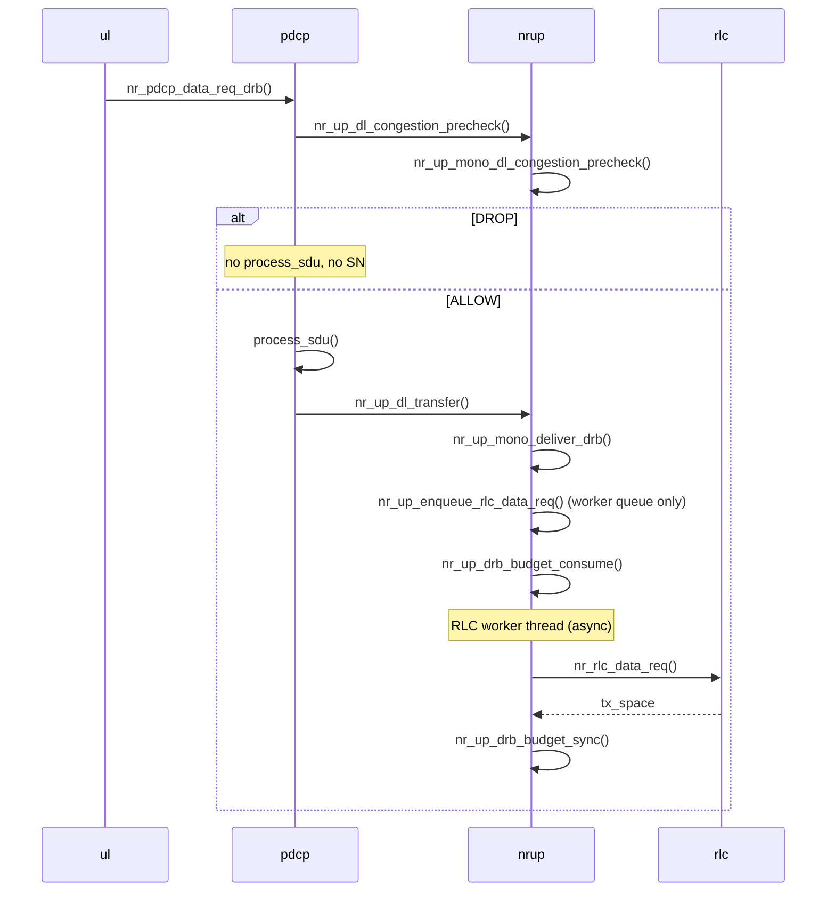

<!-- SPDX-License-Identifier: CC-BY-4.0 -->

# NR user plane (`nr_up`)

Monolithic gNB (`nr-softmodem`) downlink DRB path: PDCP precheck and transfer through
nr-up to RLC (async worker). Split CU/DU is out of scope here.

## Downlink data path

