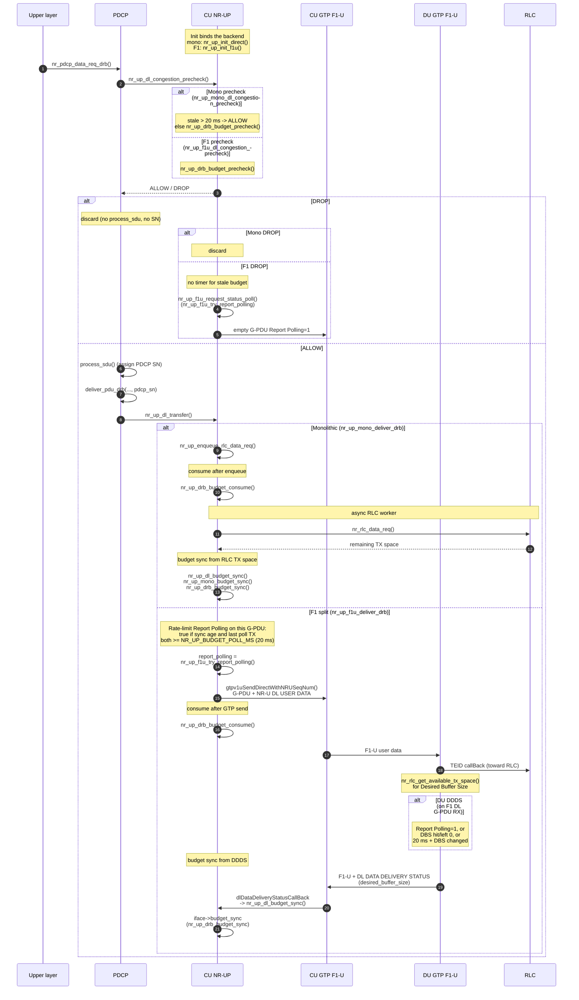

<!-- SPDX-License-Identifier: CC-BY-4.0 -->

# NR user plane (`nr_up`)

`nr_up` sits between PDCP and the lower user-plane path on gNB and UE. It
decides whether a downlink DRB SDU may proceed (congestion admission), then
delivers the sealed PDCP PDU either to local RLC (mono / UE) or over F1-U GTP
(CU). PDCP talks only to this API. 

## Why we need this layer ?

Without an early admission check, a DL SDU can be ciphered, given a PDCP SN,
and pushed toward RLC (or F1-U) only to be thrown away when a lower buffer is
full. That wastes crypto and queue work, and it opens a PDCP SN gap at the
receiver.

**TS 38.323** (PDCP) makes that ordering explicit.

Clause 5.2.1 (Transmit operation):

> For a PDCP SDU received from upper layers, the transmitting PDCP entity shall:
>
> - associate the COUNT value [...]
> - perform integrity protection, and ciphering [...]
> - set the PDCP SN of the PDCP Data PDU [...]
> - increment TX_NEXT by one
> - submit the resulting PDCP Data PDU to lower layer [...]

Clause 5.3 (SDU discard):

> If the corresponding PDCP Data PDU has already been submitted to lower layers,
> the discard is indicated to lower layers.
>
> NOTE 2: Discarding a PDCP SDU already associated with a PDCP SN causes a SN
> gap in the transmitted PDCP Data PDUs, which increases PDCP reordering delay
> in the receiving PDCP entity. It is up to UE implementation how to minimize
> SN gap after SDU discard.

So congestion admission belongs before `process_sdu` / SN advance: if the
SDU will not be sent, it must never consume an SN.

**TS 38.322** (RLC) clause 5.4 (SDU discard) ties discard at RLC to a PDCP
indication:

> When indicated from upper layer (i.e. PDCP) to discard a particular RLC SDU,
> the transmitting side of an AM RLC entity or the transmitting UM RLC entity
> shall discard the indicated RLC SDU, if neither the RLC SDU nor a segment
> thereof has been submitted to the lower layers. The transmitting side of an
> AM RLC entity shall not introduce an RLC SN gap when discarding an RLC SDU.

**TS 38.425** (NR user plane) clause 5.1 places flow control at the PDCP host:

> The NR user plane protocol layer is using services of the transport network
> layer in order to allow flow control of user data packets transferred from
> the node hosting PDCP to the corresponding node.

On F1, that is Desired Buffer Size / DDDS on the midha. The important part
for OAI is where the stop/send decision lives: at the node that hosts PDCP,
before SN assignment.

That is why both layouts share `nr_up`:

- Monolithic gNB: PDCP and RLC are in one process, but admission still
  happens in `nr_up` using a cached RLC TX budget.
- F1 / CU: the same `nr_up` precheck and budget cache, the F1 backend
  refreshes the cache from DDDS and asks for status with Report Polling.

PDCP calls nr-up only. The backend is chosen at `nr_up_init_*`:

| Role | PDCP deliver | nr-up init | Backend |
|------|--------------|------------|---------|
| gNB mono | `deliver_pdu_drb` | `nr_up_init_direct` | PDCP DL goes to local RLC (same process) |
| gNB F1 / CU | `deliver_pdu_drb` | `nr_up_init_f1u` | PDCP DL goes over F1-U GTP to the DU |
| gNB DU | - | `nr_up_init_du` | no PDCP deliver, only turns off RLC TX-full drop (CU already decided) |
| UE | `deliver_pdu_drb` | `nr_up_init_ue` | PDCP DL goes to local RLC (UE stack) |

## DRB downlink

For each DL SDU on the gNB, PDCP asks nr-up whether the backend or local
RLC can take more data before assigning a PDCP SN. If nr-up says DROP,
the SDU is discarded and no SN is consumed. If ALLOW, PDCP builds the PDU
and hands it to the role backend from the table above.

1. `nr_pdcp_data_req_drb`: entry from upper layers
2. `nr_up_dl_congestion_precheck`: ALLOW or DROP
3. `rb->process_sdu`: assign SN and build the PDCP PDU (upon ALLOW only)
4. `deliver_pdu_drb` -> `nr_up_dl_transfer` -> `iface->deliver_drb`:
   mono enqueues to local RLC, F1/CU sends on GTP F1-U

CU congestion uses a shared per-DRB budget cache
(`nr_up_drb_budget_precheck` / `consume` / `sync`). Precheck never calls
RLC live. Insufficient budget drops (DROP) until a later sync.

- **Mono** precheck (`nr_up_mono_dl_congestion_precheck`): if last sync is
  older than `NR_UP_MONO_BUDGET_STALE_MS` (20 ms), ALLOW without trusting
  occupancy.
- **F1** precheck (`nr_up_f1u_dl_congestion_precheck`): on DROP, rate-limited
  empty DL USER DATA with Report Polling (`nr_up_f1u_request_status_poll`)
  so DDDS can refresh.
- On F1 deliver, CU sets Report Polling when the cache is missing or sync age
  is at least `NR_UP_BUDGET_POLL_MS` (20 ms) and the last poll TX is at least
  that old (`nr_up_f1u_try_report_polling`). Report Delivered stays off
  (needs feedback on RLC AM in-sequence delivery).

## Downlink DRB procedures (mono and F1)

```mermaid
sequenceDiagram
  autonumber
  participant Upper as Upper layer
  participant PDCP as PDCP
  participant CUNR as CU NR-UP
  participant CUGTP as CU GTP F1-U
  participant DUGTP as DU GTP F1-U
  participant RLC as RLC

  Note over CUNR: Init binds the backend<br/>mono: nr_up_init_direct()<br/>F1: nr_up_init_f1u()

  Upper->>PDCP: nr_pdcp_data_req_drb()
  PDCP->>CUNR: nr_up_dl_congestion_precheck()

  alt Mono precheck (nr_up_mono_dl_congestion_precheck)
    Note over CUNR: stale > 20 ms -> ALLOW<br/>else nr_up_drb_budget_precheck()
  else F1 precheck (nr_up_f1u_dl_congestion_precheck)
    Note over CUNR: nr_up_drb_budget_precheck()
  end
  CUNR-->>PDCP: ALLOW / DROP

  alt DROP
    Note over PDCP: discard (no process_sdu, no SN)
    alt Mono DROP
      Note over CUNR: discard
    else F1 DROP
      Note over CUNR: no timer for stale budget
      CUNR->>CUNR: nr_up_f1u_request_status_poll()<br/>(nr_up_f1u_try_report_polling)
      CUNR->>CUGTP: empty G-PDU Report Polling=1
    end
  else ALLOW
    PDCP->>PDCP: process_sdu() (assign PDCP SN)
    PDCP->>PDCP: deliver_pdu_drb(..., pdcp_sn)
    PDCP->>CUNR: nr_up_dl_transfer()

    alt Monolithic (nr_up_mono_deliver_drb)
      CUNR->>CUNR: nr_up_enqueue_rlc_data_req()
      Note over CUNR: consume after enqueue
      CUNR->>CUNR: nr_up_drb_budget_consume()
      Note over CUNR,RLC: async RLC worker
      CUNR->>RLC: nr_rlc_data_req()
      RLC-->>CUNR: remaining TX space
      Note over CUNR: budget sync from RLC TX space
      CUNR->>CUNR: nr_up_dl_budget_sync()<br/>nr_up_mono_budget_sync()<br/>nr_up_drb_budget_sync()
    else F1 split (nr_up_f1u_deliver_drb)
      Note over CUNR: Rate-limit Report Polling on this G-PDU:<br/>true if sync age and last poll TX<br/>both >= NR_UP_BUDGET_POLL_MS (20 ms)
      CUNR->>CUNR: report_polling =<br/>nr_up_f1u_try_report_polling()
      CUNR->>CUGTP: gtpv1uSendDirectWithNRUSeqNum()<br/>G-PDU + NR-U DL USER DATA
      Note over CUNR: consume after GTP send
      CUNR->>CUNR: nr_up_drb_budget_consume()
      CUGTP->>DUGTP: F1-U user data
      DUGTP->>RLC: TEID callBack (toward RLC)
      Note over DUGTP: nr_rlc_get_available_tx_space()<br/>for Desired Buffer Size
      alt DU DDDS (on F1 DL G-PDU RX)
        Note over DUGTP: Report Polling=1, or<br/>DBS hit/left 0, or<br/>20 ms + DBS changed
      end
      Note over CUNR: budget sync from DDDS
      DUGTP->>CUGTP: F1-U + DL DATA DELIVERY STATUS<br/>(desired_buffer_size)
      CUGTP->>CUNR: dlDataDeliveryStatusCallBack<br/>-> nr_up_dl_budget_sync()
      CUNR->>CUNR: iface->budget_sync<br/>(nr_up_drb_budget_sync)
    end
  end
```
